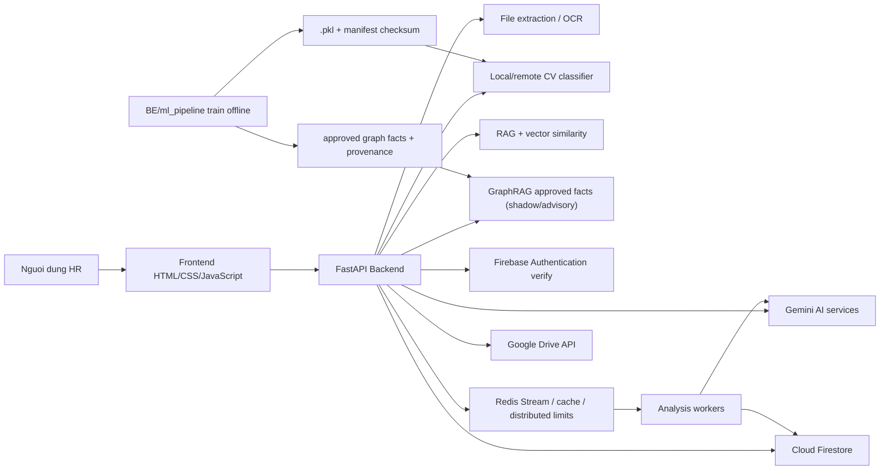
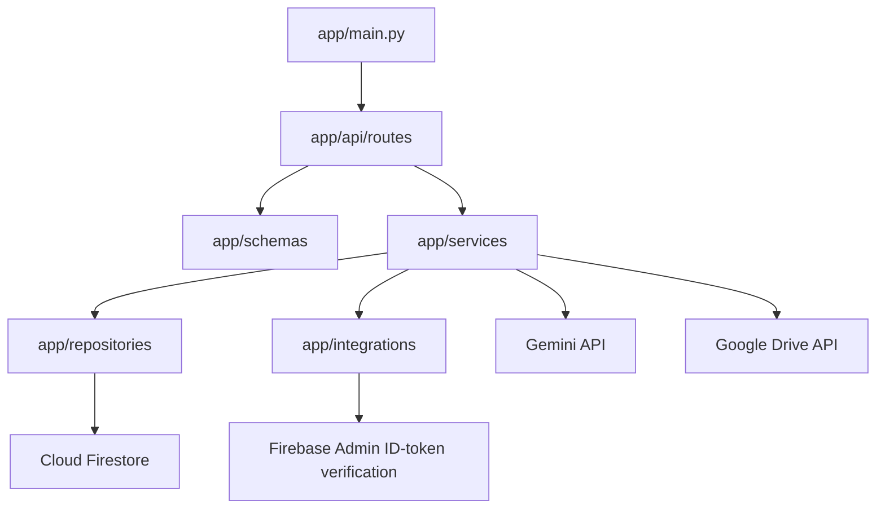
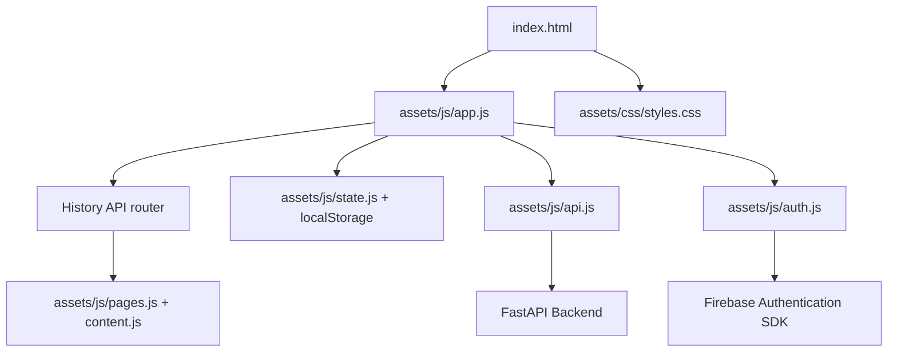

# 02 - Kien truc he thong

> Firebase Authentication và Cloud Firestore là nguồn dữ liệu duy nhất. Xem `13-firebase-restoration-runbook.md`.

## Tong quan thu muc

```text
D:\Support HR\
|- Document\
`- Software\
   |- Web\
   |  |- FE\
   |  |- BE\
   |  |  |- api_server\
   |  |  `- ml_pipeline\
   |  `- ml_pipeline\ (workspace du lieu cu, khong deploy)
   `- Android\
```

Trong `Software`:

- `Web/FE`: SPA HTML + CSS + JavaScript thuần, không có bước build, deploy static trên Cloudflare Pages.
- `Web/BE/api_server`: FastAPI, dong goi OCI image va deploy tren VPS Docker Compose hoac K3s.
- `Web/BE/ml_pipeline`: ma train/seed canonical, chay offline; chi artifact + manifest duoc deploy.
- `Web/ml_pipeline`: workspace dataset cu de doi chieu/chuyen du lieu, khong phai runtime production.
- `Android`: Expo/React Native companion app.

## Kien truc tong the



## Luong chay khi phan tich CV

```mermaid
sequenceDiagram
    participant User as HR/User
    participant FE as Frontend
    participant BE as Backend
    participant OCR as File Extraction
    participant AI as Gemini
    participant DB as Cloud Firestore

    User->>FE: Nhap JD + upload CV
    FE->>BE: POST /api/files/extract-text
    BE->>OCR: Doc PDF/DOCX/Image/TXT/CSV
    OCR-->>BE: Text da lam sach
    BE-->>FE: extracted text

    FE->>BE: POST /api/jd/structure
    BE->>AI: Chuan hoa JD
    AI-->>BE: JD co cau truc
    BE-->>FE: structured_text

    FE->>BE: POST /api/analysis/jobs
    BE->>DB: Kiem cache/history neu co user
    BE->>BE: Classifier 1 lan + embedding 1 lan/CV (bounded concurrency)
    BE->>DB: Cloud Firestore vector nearest-neighbor, chi exemplar approved v2
    BE->>BE: Truy van approved GraphRAG facts o shadow mode
    BE->>AI: Cham diem CV theo JD; GraphRAG khong thay doi scoring
    AI-->>BE: Ket qua core
    BE->>BE: Enrich + advanced breakdown + ranking
    BE->>DB: Luu cache/history
    FE->>BE: GET /api/analysis/status/{job_id}
    BE-->>FE: candidates + pipeline
```

## Kien truc backend



Vai tro tung tang:

- `app/main.py`: tao FastAPI app, cau hinh CORS, mount router.
- `app/api/routes`: dinh nghia endpoint HTTP.
- `app/schemas`: Pydantic request/response model.
- `app/services`: business logic, AI, OCR, scoring, account.
- `app/repositories`: helper truy cap Cloud Firestore collection.
- `app/integrations`: ket noi Firebase Admin ID-token verification, Cloud Firestore pool, Redis va cac provider ngoai.

## Kien truc frontend



Frontend giu cac state chinh:

- `jdText`, `jobPosition`.
- `weights`.
- `hardFilters`.
- `cvs` sau khi trích xuất text.
- `analysisStatus`, `analysisProgress`, `jobId`, `candidates`.
- `history`, `templates` cục bộ.
- `backend.live`, `backend.ready`.
- Firebase session riêng trong localStorage versioned.

## Cac he thong ngoai

### Gemini

Dung cho:

- Generate text.
- Chuan hoa JD.
- Rut hard filters.
- Phan tich CV.
- OCR anh/PDF scan.
- Embedding text.

### Firebase

Dung cho:

- Dang nhap tren frontend.
- Verify token tren backend.
- Luu Cloud Firestore data.

### Google Drive

Dung cho:

- OAuth ket noi Drive.
- Liet ke file.
- Tai/export file.
- Dua file vao cung pipeline OCR nhu upload local.

### Self-hosted backend va Cloudflare Pages

- Backend dung mot image GHCR da kien truc; Docker Compose la duong production mot VPS, K3s la duong nang cap.
- Caddy cap HTTPS va reverse proxy cho Compose; Traefik ingress phuc vu overlay K3s OCI Free.
- `render.yaml` chi duoc giu tam trong giai doan cutover de rollback, khong con la runtime chinh.
- Frontend deploy trực tiếp từ thư mục gốc; Cloudflare Pages tự phục vụ `index.html` cho route SPA khi không có `404.html`.

## Vi sao tach FE/BE/ML?

Tach nhu vay giup:

- Frontend nhe, chi lo giao dien va trai nghiem.
- Backend bao ve API key, Firebase Admin service account, Google OAuth secret.
- Ma ML nam cung repo backend de dong bo contract, nhung train/seed luon chay offline va data raw bi Git ignore.
- Container runtime chi nap `.pkl` da duyet; startup kiem checksum, nhan, schema va scikit-learn version.
- Backend la modular monolith; chua tach classifier service khi chua co nhu cau scale doc lap.
- API va analysis worker dung chung mot image nhung chay thanh hai process/Deployment rieng.
- Docker Compose production chay API + worker + Redis + Caddy; Kubernetes scale API va worker doc lap.
- FE len Cloudflare Pages; Docker Compose va Kubernetes deu dung Redis Stream va worker rieng.
- Cloud Firestore native vector search la RAG production.
- GraphRAG phase 1 doc artifact da duyet, chi tra bang chung advisory voi
  `decisionImpact=none`; shadow mode khong dua fact vao prompt, diem hoac xep hang.
