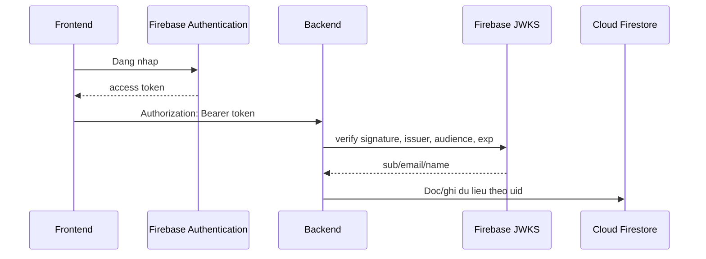

# 07 - Database, auth va luu tru

> Runtime hiện là Firebase Authentication + Cloud Firestore/Security Rules + Realtime duy nhất. Schema hybrid giữ field typed/indexed cùng `source_payload JSONB`, ID nguồn và SHA-256; công cụ import nguồn cũ được tách khỏi dependency production.

## Auth tong quan

Frontend dung Firebase Authentication. Backend dung Firebase Admin ID-token verification de verify token.

Luong:



## Vi sao can backend verify token?

Neu chi tin email tu frontend thi nguoi dung co the gia mao. Backend verify token de chac chan:

- Token do Firebase cap.
- Token con hop le.
- `uid` dung la user that.
- Moi du lieu ghi/doc deu gan voi `uid`.

## Cloud Firestore repository

File:

```text
app/repositories/firestore/account_repository.py
```

File nay khong phai ORM phuc tap. No chu yeu tra ve collection reference va helper CRUD co ban.

## Cac collection chinh

### `users`

Luu profile nguoi dung:

- `uid`
- `email`
- `displayName`
- `avatar`
- `provider`
- `createdAt`
- `updatedAt`

### `cvHistory`

Luu lich su CV/JD va snapshot phan tich day du.

Field thuong gap:

- `uid`
- `email` / `userEmail`
- `jdText`
- `jdTitle`
- `jobPosition`
- `locationRequirement`
- `results`
- `fullPayload`
- `grades`
- `topCandidates`
- `timestamp`

### `syncedAnalysisCache`

Luu cache ket qua phan tich theo:

- `uid`
- `cacheKey`
- hash cua JD/weights/filters
- candidate result

Muc dich:

- Neu cung CV + JD da phan tich, co the tai su dung ket qua.
- Giam so lan goi AI.

### `syncedAnalysisHistory`

Luu lich su dong bo cua phien phan tich.

### `uploadedFiles`

Luu metadata file da upload/import:

- `fileName`
- `fileType`: `cv` hoac `jd`
- `fileSize`
- `mimeType`
- `fileExtension`
- `ocrMethod`
- `extractedText`
- `extractedTextLength`
- `processingTimeMs`
- `analysisSessionId`
- `candidateName`
- `jobPosition`
- `uploadedAt`

### `userJDTemplates`

Luu JD template ca nhan:

- `name`
- `category`
- `jobPosition`
- `jdText`
- `hardFilters`
- `createdAt`
- `updatedAt`

### `chatbotSessions`

Luu hoi thoai chatbot:

- `jobPosition`
- `totalCandidates`
- `sessionTitle`
- `messages`
- `messageCount`
- `createdAt`
- `updatedAt`
- `lastMessageAt`

### `googleDriveConnections`

Luu ket noi Google Drive:

- `accessToken`
- `refreshToken`
- `expiresAt`
- `scopes`
- `email`
- `displayName`
- `photoUrl`
- `driveUserId`

### `googleDriveOAuthStates`

Luu state ngan han trong OAuth flow:

- `uid`
- `redirectUri`
- `createdAt`
- `expiresAt`

### `analysisFeedback`

Luu feedback ve ket qua AI:

- `uid`
- `sessionId`
- `candidateId`
- `jobPosition`
- `action`
- `aiScore`
- `finalScore`
- `reason`
- `notes`
- `severity`
- `createdAt`

### `approvedExemplars`

Luu exemplar da duyet cho RAG:

- CV/analysis mau.
- Rubric version.
- Embedding.
- Metadata nganh, seniority, job title.
- Trang thai approved.

### `analysisJobs`

Luu snapshot job phan tich async:

- `jobId`
- `uid`
- `status`
- `progress`
- `message`
- `result`
- `error`
- `sourceTexts`
- `createdAt`
- `updatedAt`

## Google Drive storage flow

SupportHR khong luu file goc Drive vao backend nhu object storage. Backend:

1. Lay OAuth token.
2. List file.
3. Download/export file.
4. Trich text.
5. Luu metadata va extracted text vao Cloud Firestore neu can.

Y nghia:

- Tranh phai quan ly file binary lon.
- Tap trung vao text phuc vu AI.

## Data privacy can noi khi thuyet trinh

Nen noi:

- Backend verify Firebase token truoc khi doc/ghi du lieu ca nhan.
- Moi history/cache/file gan voi `uid`.
- API key, database URL va khoa ma hoa nam o bien moi truong backend.
- `.env.example` chi la template, khong chua secret.
- Feedback/history giup user tai su dung ket qua, khong phai public data.

## Diem co the cai tien sau

- Tach `cvHistory` thanh nhieu collection ro hon neu payload qua da dang.
- Them TTL cleanup cho OAuth state/job cu.
- Them role admin neu can dashboard quan tri.
- Ma hoa them mot so field nhay cam neu dua vao production lon.
- Them object storage rieng neu muon luu file goc.

## Database performance contract 2026-07-22

- Runtime dung Supavisor pooled URL qua psycopg `ConnectionPool`; moi process co gioi han pool, waiting queue,
  acquire timeout, max idle/lifetime va Cloud Firestore statement timeout. Tong `pool_max * so process` phai nam
  duoi quota connection cua project Firebase.
- Migration `202607220002_api_performance_indexes.sql` backfill typed timestamp va tao composite index
  `(owner_id, coalesce(source_updated_at, updated_at) desc, id desc)` cho keyset pagination.
- Cac filter thuong dung co index rieng: uploaded `file_type`/`analysisSessionId`, feedback `action` va cac ID
  lien ket, sync cache `cacheKey`, chatbot `jobPosition`.
- JSONB `source_payload` van bao toan payload goc, nhung filter/order quan trong dung typed column/index.
- Merge Settings la atomic UPSERT; write-through Redis chi la cache, Cloud Firestore van la source of truth.
