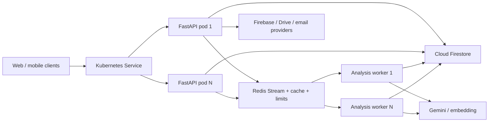

# 12 - Backend inventory, gap audit and scale plan

Snapshot: 2026-07-22. Source of truth: `Software/Web/BE` code and rendered runtime routes.

## Executive summary

SupportHR backend is a modular FastAPI monolith with a broad recruiter workflow, Firebase/Firestore
persistence, Gemini, OCR, local classifier, RAG and Redis cache. Runtime inspection after this scale pass
shows 87 HTTP routes. The existing functional breadth is strong, but production maturity is uneven:
background execution, containerization and Kubernetes baseline are now implemented; observability,
release automation, tenant/RBAC boundaries, data-retention controls and a real cluster rollout are not complete.

Verified checks at the start of the pass: 63/63 tests passed. Final suite: 67/67 tests passed. New queue tests
cover cross-process Redis state, worker completion, slot release, malformed stream data and Redis-unavailable rejection.

## Current capability inventory

| Area | Routes | Current functions |
| --- | ---: | --- |
| Account and recruiter data | 61 | Profile, settings, sync/cache, history, mobile inbox, feedback, notifications, uploaded files, vectorization, JD templates, chatbot sessions, Google Drive and email |
| CV analysis | 11 | Core/async analysis, job polling, quick score, profile refinement, candidate chat, classifier status/classification and enrichment |
| JD workflow | 3 | Structure JD, extract position and extract hard filters |
| Mobile JD | 2 | Standardize text or uploaded file |
| Rubrics | 2 | List role rubrics and get a rubric by key |
| Gemini primitives | 2 | Generate and embed |
| File/OCR | 1 | Extract text from supported CV/JD files |
| Interview | 1 | Generate interview questions |
| Salary | 1 | Analyze salary/market fit |
| Operations | 3 | Compatibility health, liveness and readiness |
| **Total** | **87** | Runtime `APIRoute` count, excluding OpenAPI/docs routes |

## Current architecture after the scale pass

Runtime rules:

- API pods do not own durable job execution.
- Redis Stream consumer groups provide pending messages, acknowledgement and stale-job reclaim.
- API and worker use the same immutable image but different commands.
- Cloud Firestore remains the system of record; Redis stores queue payloads, short-lived job state, cache and distributed limits.
- `ANALYSIS_JOB_MODE=in_process` remains only for local compatibility; Docker Compose and Kubernetes use `redis`
  with a separate worker.

## Gap matrix

| Priority | Gap | Evidence | Status / required action | Confidence |
| --- | --- | --- | --- | --- |
| P0 | In-process async jobs were lost on restart | Previous `analysis_job_service.py` used `asyncio.create_task`; ADR-001 recorded the limitation | Addressed with Redis Stream worker, pending reclaim and shared state; load/failure tests still required | High |
| P0 | Cloud runtime is not deployed yet | OCI Free K3s overlay, GHCR registry target and VPS Compose path now exist; VM, DNS and secrets are not provisioned | Provision OCI VM, apply immutable tag, run smoke gates, then cut over DNS/client API URL | High |
| P0 | Costly AI primitives allow optional authentication | Gemini generate/embed and several analysis routes use `get_optional_current_user` | Require auth/App Check or signed anonymous quota for production; separate public demo limits from recruiter limits | High |
| P0 | Production secrets are manual | Kubernetes has only `secret.example.yaml`; no External Secrets/CSI integration | Connect cloud secret manager, rotate credentials, prohibit plain committed Secret manifests | High |
| P1 | Backend delivery pipeline is partial | GHCR multi-arch build with SBOM/provenance and gated SSH rollout with health rollback exist; test, vulnerability scan and signing are not yet automated | Add test/scan/sign gates; retain verified-host SSH, immutable tags and deploy health rollback | High |
| P1 | No metrics/tracing/SLO | Audit logger exists; no Prometheus/OpenTelemetry endpoint, dashboard or alerts | Add request/job metrics, provider latency/quota metrics, traces, error budget and alerts before production scale | High |
| P1 | Worker HPA is resource-based only | `autoscaling/v2` uses CPU/memory | Add KEDA/external metric for Redis pending/lag; keep CPU/memory as safety metrics | High |
| P1 | At-least-once delivery needs idempotency proof | Redis Stream can redeliver a reclaimed job | Add idempotency keys and tests around history/cache/email writes; deduplicate by `job_id` | High |
| P1 | Tenant and role boundary is user-only | Firebase identity is mapped to `uid`; no organization/role policy layer is visible | Add organization, recruiter/admin roles, ownership policy and audit authorization before multi-company use | High |
| P1 | PII retention and deletion are incomplete | CV/JD source text is persisted in job/history flows; no retention scheduler/runbook is present | Define retention, delete/export workflows, encryption/key policy and log redaction | High |
| P1 | API has no explicit version namespace | Public paths use `/api/...` | Introduce compatibility/version policy before breaking schema changes; publish deprecation windows | High |
| Addressed | Large account lists lacked one scalable pagination contract | History, uploaded files and JD templates now expose cursor pages with field allowlists | Keyset SQL, max page size 200, query-level JSONB projection and composite indexes; retain legacy bounded routes for compatibility | Medium |
| P2 | Provider resilience is partial | Gemini key/model fallback exists, but no global circuit breaker or provider SLO is defined | Add bounded retries with jitter, circuit breakers, per-provider timeouts and fallback telemetry | Medium |
| P2 | Chaos/recovery suite is incomplete | k6 critical-read load gate now exists; unit/API contracts cover pool, gzip, cursor and atomic merge | Run staging capacity baseline, pod-kill recovery, Redis outage and Cloud Firestore/Gemini degradation scenarios | High |
| P2 | Ingress and production storage are intentionally placeholders | Ingress file is example-only; local Redis is not HA | Choose ingress class, WAF/rate limit, managed Redis topology, backup and multi-zone policy | High |

## Implemented scale baseline

- Multi-stage non-root Docker image shared by API and worker.
- Compose stack with API, persistent local Redis and independently scalable worker service.
- VPS bootstrap installs Docker/firewall/security updates; systemd watchdog heals missing or unhealthy containers every two minutes.
- GitHub production workflow deploys immutable GHCR tags over verified-host SSH while runtime secrets remain on the VM.
- Redis Stream consumer group with acknowledgement and stale pending-message reclaim.
- Redis-backed shared job state and expiring per-user concurrency slots.
- `/health/live` and `/health/ready`; readiness checks Redis when queue mode requires it.
- Kubernetes API/worker Deployments, ClusterIP Service, HPA, PDB, NetworkPolicy, probes, resource requests/limits,
  rolling update policy, topology spread and read-only root filesystem.
- Local and production Kustomize overlays; production deliberately requires a real image tag and secret.
- Bounded psycopg/Redis pools, atomic JSONB merge, batch cleanup and grouped aggregates remove hot-path query fan-out.
- Settings cache uses Redis stampede lock, write-through invalidation and optimistic concurrency through ETag/If-Match.
- Cursor pagination and database-side field projection are available for the three largest account list families.
- Gzip plus timing/cache headers provide payload reduction and lightweight latency visibility.
- `loadtests/k6-critical-api.js` defines the initial p95/p99/error guardrail; production capacity is not inferred from unit tests.

## Scale roadmap

### Stage 0 - Release this baseline safely

1. Provision the selected OCI Free VM and publish the first GHCR multi-architecture image.
2. Pin an immutable `sha-*` tag; scan it and record its digest/SBOM.
3. Create runtime secrets outside Git; the single-node free tier uses persistent local Redis, while multi-node production still requires managed Redis.
4. Configure Caddy HTTPS for Compose or Traefik/TLS for K3s, then point DNS and enable rate limiting/WAF where available.
5. Run migration/index checks, smoke tests and a worker-crash recovery test.

Exit gate: both rollouts ready, `/health/ready` healthy, one queued analysis survives worker termination, and rollback is rehearsed.

### Stage 1 - Observability and delivery automation

1. Add structured request/job logs with request ID and `job_id` correlation.
2. Expose Prometheus metrics and OpenTelemetry traces.
3. Track queue lag, pending count, processing time, Gemini latency/quota, Cloud Firestore errors and cache hit rate.
4. Add CI/CD gates and progressive rollout.

Suggested initial SLOs: API availability 99.9%; non-AI p95 under 500 ms; job acceptance p95 under 1 s;
completed-job success above 99%; no pending job older than its reclaim/alert threshold.

### Stage 2 - Queue-depth autoscaling and resilience

1. Add KEDA/external metrics for Redis Stream lag/pending jobs.
2. Add idempotency keys and job retry/dead-letter policy.
3. Test Redis failover, worker crash, pod drain, provider timeout and Cloud Firestore throttling.
4. Tune worker memory/CPU using measured CV batch sizes, not guesses.

### Stage 3 - Multi-tenant governance

1. Add organization membership and role policy.
2. Partition/query data by tenant and enforce ownership centrally.
3. Add retention/deletion/export and audit-log controls.
4. Add tenant quotas, budget limits and per-provider usage accounting.

### Stage 4 - Split services only from metrics

Keep the modular monolith while it scales. Split classifier, OCR or provider gateway only when profiles show
independent resource pressure, deployment cadence or failure isolation needs. Do not create microservices solely
because Kubernetes is available.

## Deployment truth at this snapshot

- Docker image: built successfully as `supporthr-backend:local` (about 218 MB).
- Docker Compose runtime: API, Redis and two worker replicas are healthy; readiness confirms classifier and Redis.
- Redis Stream smoke test: two consumers process the group; malformed input is acknowledged and leaves `pending=0`.
- Kustomize local overlay: renders 13 YAML documents and parses offline.
- Kustomize production overlay: renders 10 YAML documents and parses offline.
- GHCR workflow: YAML parses and defines AMD64/ARM64 Buildx output with SBOM/provenance metadata.
- Production Compose: offline `docker compose config --quiet` succeeds with the example environment; Docker Engine was not running for an image/runtime smoke test in this change.
- OCI Free K3s overlay: renders offline with one API Deployment, one worker Deployment, one persistent Redis StatefulSet and no HPA/PDB on the single node.
- Kubernetes runtime: `kind` 0.32.0 created `kind-supporthr` (Kubernetes v1.36.1); local Redis, API and worker
  deployments are all Ready. Service readiness confirms classifier and Redis.
- Metrics/HPA: official Metrics Server 0.8.1 is Ready; `kubectl top` returns pod metrics and both HPAs show valid
  CPU/memory targets. The kind-only insecure kubelet TLS flag is documented and excluded from production.
- Kubernetes queue smoke: one consumer, lag 0, pending 0 after malformed-message handling.
- Performance contract tests: 81 backend tests pass, including atomic Settings merge, cursor projection, bounded pool,
  gzip, conditional ETag and Redis worker dispatch for analysis/vector rebuild.
- Local TestClient payload check: `/openapi.json` changed from 107,413 bytes identity to 10,422 bytes gzip
  (90.3% smaller). This is a payload check, not a production throughput claim.
- k6 critical-read scenario and thresholds are committed, but k6 was not installed on this workstation and no
  production/staging capacity result is claimed.

Therefore the existing local Docker Compose and kind paths remain verified, and the new self-host manifests validate offline.
A cloud production deployment is not yet a verified fact because no OCI VM, registry package publication, DNS or runtime secrets were provided.
