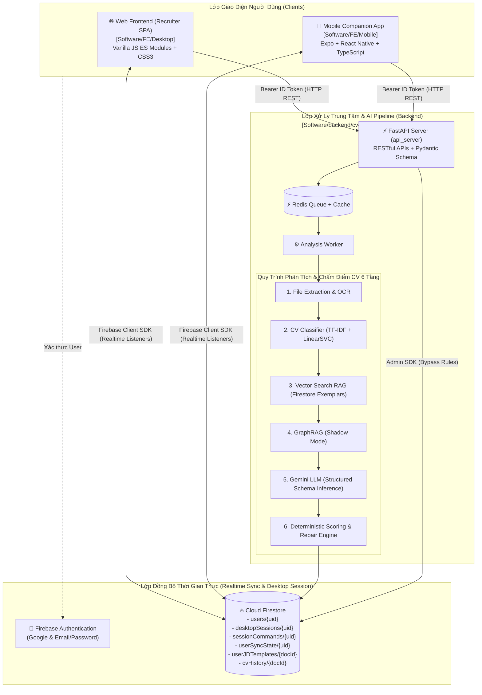

# SUPPORT HR: MASTER SYSTEM NAVIGATION & CENTRAL CONTROLLER

> **BẢN ĐỒ ĐIỀU HƯỚNG TRUNG TÂM TOÀN DỰ ÁN (MAIN CONTROLLER)**
> Quản lý và điều phối toàn diện: Backend (BE) ↔ Frontend (FE) ↔ Desktop Session ↔ Mobile Companion.
> Mọi AI Assistant (Antigravity, Claude, Codex) và Developer đều sử dụng file này làm nguồn tham chiếu cao nhất.

---

## 1. BẢN ĐỒ KIẾN TRÚC TOÀN HỆ THỐNG (SYSTEM ARCHITECTURE)



---

## 2. PHÂN VÙNG THƯ MỤC & RANH GIỚI CÔNG NGHỆ CỨNG

| Phân Vùng | Đường Dẫn Thư Mục | Công Nghệ Cho Phép | Trách Nhiệm & Chức Năng | ĐIỀU BỊ CẤM TUYỆT ĐỐI |
| :--- | :--- | :--- | :--- | :--- |
| **Backend & AI/ML** | `Software/backend/cv-match-api/` | Python 3.10+, FastAPI, Pydantic, Scikit-learn, Redis, Docker | Trích xuất CV/JD, phân loại ngành, chấm điểm AI, API endpoints chuẩn | **CẤM** đưa logic UI vào BE, cấm hardcode credentials vào code |
| **AI Assistant** | `Software/backend/ai-assistant/` | Python 3.12+, FastAPI, Firebase Admin, Gemini | Server độc lập cho trợ lý chat chung (`/ai-assistant`) — deploy, Gemini key riêng | **CẤM** chia sẻ process/deploy với `cv-match-api`; chỉ dùng chung Firebase project |
| **Classifier Service** | `Software/backend/classifier-service/` | Python 3.10+, FastAPI, Scikit-learn, Colab/Kaggle/Cloudflare | Microservice độc lập phân loại ngành CV (LinearSVC + TF-IDF) | **CẤM** gộp chung logic UI hoặc database nghiệp vụ |
| **Web Frontend** | `Software/FE/Desktop/` | Next.js 16 (App Router), TypeScript, Tailwind CSS, Lucide | Giao diện Recruiter Web App điều hành tuyển dụng chia theo 7 Domain Features | **CẤM** Supabase, hardcode production credentials |
| **Mobile App** | `Software/FE/Mobile/` | React Native, Expo, TypeScript, NativeWind, Zustand | Ứng dụng di động theo dõi ứng viên, voice feedback, điều khiển desktop | **CẤM** thẻ HTML DOM (`div`, `span`), cấm nhúng Firebase Admin Key |
| **Quy Tắc Quản Trị** | `Software/Project-Rules/` | Markdown, JSON | Quản lý tập trung toàn bộ cấu hình, rules và firestore schema | Không lưu trữ mã nguồn chạy runtime |

---

## 3. CƠ CHẾ ĐIỀU KHIỂN & ĐỒNG BỘ CHÉO (DESKTOP ↔ MOBILE SYNC)

Hệ thống kết nối thời gian thực giữa Web Desktop và Mobile App thông qua Cloud Firestore:

1. **Desktop Session State (`desktopSessions/{uid}`)**:
   - Khi Recruiter mở Web FE, Web tạo/cập nhật tài liệu `desktopSessions/{uid}` (trạng thái ứng viên đang xem, tab đang mở).
   - Mobile lắng nghe realtime để hiển thị đồng bộ ngay lập tức thông tin ứng viên trên màn hình điện thoại.
2. **Điều khiển từ xa qua Mobile (`sessionCommands/{uid}`)**:
   - Mobile gửi lệnh (Next candidate, Approve, Reject, Voice Note) vào `sessionCommands/{uid}`.
   - Web FE lắng nghe và tự động chuyển trang hoặc cập nhật trạng thái mà không cần chạm chuột.
3. **Trigger làm mới nhẹ (`userSyncState/{uid}`)**:
   - Backend cập nhật revision khi hoàn tất phân tích hàng loạt. Web và Mobile tự động refresh danh sách.

---

## 4. HỆ THỐNG ĐIỀU HƯỚNG QUY TẮC & SKILLS (RULES & SKILLS REGISTRY)

### A. Thư Mục Quản Trị Quy Tắc: `Project-Rules/`
* [antigravity/ANTIGRAVITY.md](file:///d:/Support%20HR/Software/Project-Rules/antigravity/ANTIGRAVITY.md): Luật vận hành đầy đủ của Antigravity AI Engine.
* [claude/CLAUDE.md](file:///d:/Support%20HR/Software/Project-Rules/claude/CLAUDE.md): Luật vận hành dành cho Claude Code.
* [codex/CODEX.md](file:///d:/Support%20HR/Software/Project-Rules/codex/CODEX.md): Luật vận hành dành cho Codex.
* [firebase/](file:///d:/Support%20HR/Software/Project-Rules/firebase/): Quản lý tập trung `firestore.rules`, `firestore.indexes.json`, và `firebase.json`.
* [git/](file:///d:/Support%20HR/Software/Project-Rules/git/): Chính sách Git ignore và ranh giới multi-repo.
* [skills/README.md](file:///d:/Support%20HR/Software/Project-Rules/skills/README.md): Bảng tổng hợp năng lực các Skills.

### B. Bộ Rules Tự Động Nạp Tại `.agents/rules/`
1. [core-principles.md](file:///d:/Support%20HR/Software/.agents/rules/core-principles.md): Nguyên tắc No Yapping, tư duy trước khi code, Clean Code.
2. [frontend-standards.md](file:///d:/Support%20HR/Software/.agents/rules/frontend-standards.md): Tiêu chuẩn UI/UX, Design tokens, Responsive 390px.
3. [backend-standards.md](file:///d:/Support%20HR/Software/.agents/rules/backend-standards.md): Tiêu chuẩn RESTful API, Schema validation, Database transactions.
4. [git-and-safety.md](file:///d:/Support%20HR/Software/.agents/rules/git-and-safety.md): Kiểm soát an toàn Git, chống mất mát dữ liệu.
5. [mcp-and-tools.md](file:///d:/Support%20HR/Software/.agents/rules/mcp-and-tools.md): Hướng dẫn sử dụng CodeGraph, DevTools, ECharts, Firebase MCP.

### C. Bộ Skills Chuyên Sâu Tại `.agents/skills/`
- [ui-ux-pro-max](file:///d:/Support%20HR/Software/.agents/skills/ui-ux-pro-max/SKILL.md) | [code-refactoring-clean-code](file:///d:/Support%20HR/Software/.agents/skills/code-refactoring-clean-code/SKILL.md) | [api-backend-engineering](file:///d:/Support%20HR/Software/.agents/skills/api-backend-engineering/SKILL.md) | [git-safe-workflow](file:///d:/Support%20HR/Software/.agents/skills/git-safe-workflow/SKILL.md) | [mcp-tool-mastery](file:///d:/Support%20HR/Software/.agents/skills/mcp-tool-mastery/SKILL.md) | [fullstack-troubleshooting](file:///d:/Support%20HR/Software/.agents/skills/fullstack-troubleshooting/SKILL.md)

---

## 5. RUNBOOK HƯỚNG DẪN KHỞI CHẠY HỆ THỐNG CỤC BỘ (LOCAL RUNBOOK)

Mở 3 terminal độc lập để chạy toàn bộ hệ thống:

```powershell
# 1. Khởi chạy Backend API & Worker (Port 8000)
cd "D:\Support HR\Software\backend\cv-match-api"
uvicorn api_server.main:app --reload --port 8000

# 2. Khởi chạy Web Frontend Recruiter SPA (Port 3000)
cd "D:\Support HR\Software\FE\Desktop"
npx serve -s . -l 3000

# 3. Khởi chạy Mobile Companion App (Port 8081 / Web 19006)
cd "D:\Support HR\Software\FE\Mobile"
npm run web

# 4. Khởi chạy AI Assistant server (Port 8080)
cd "D:\Support HR\Software\backend\ai-assistant"
uvicorn app.main:app --reload --port 8080
```
